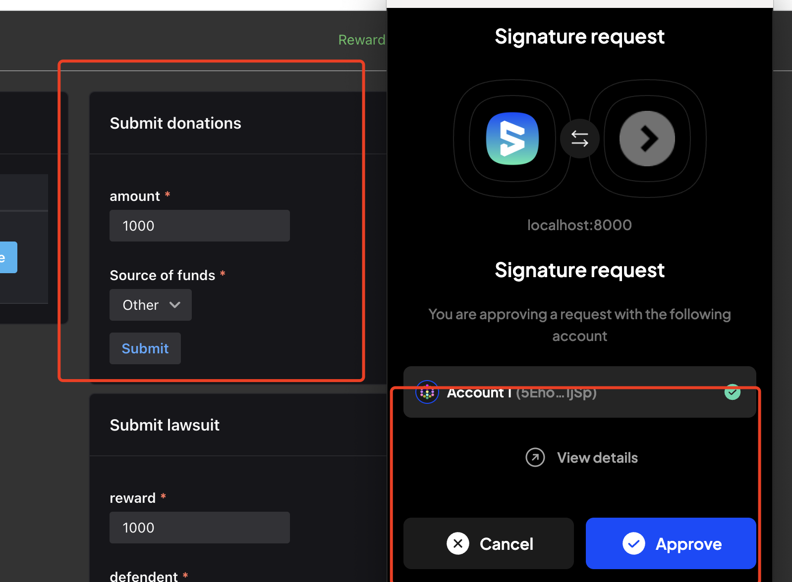
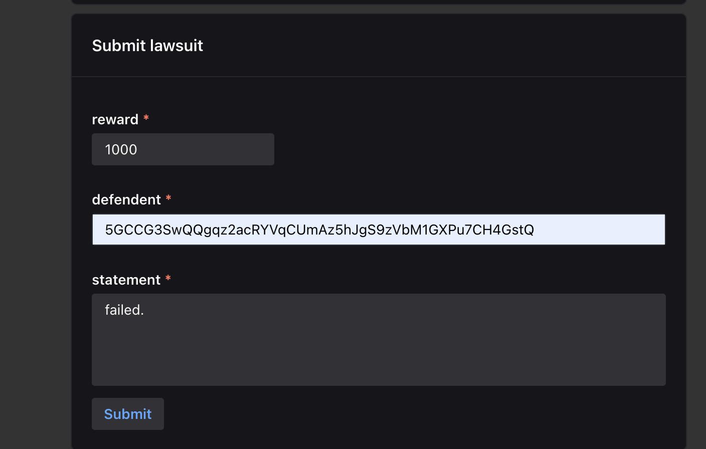
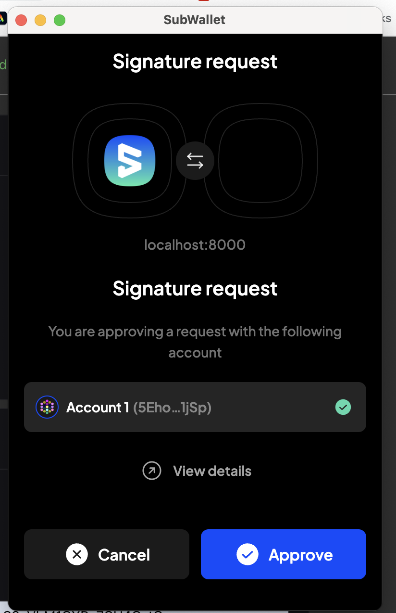
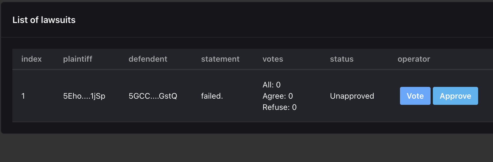
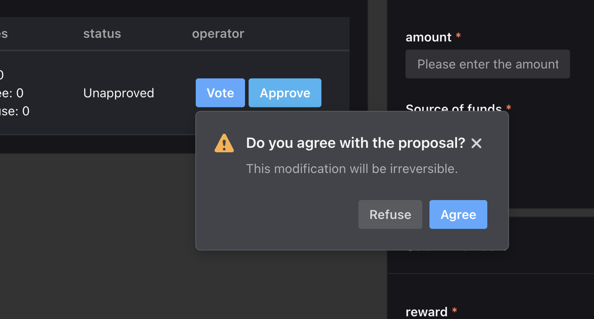
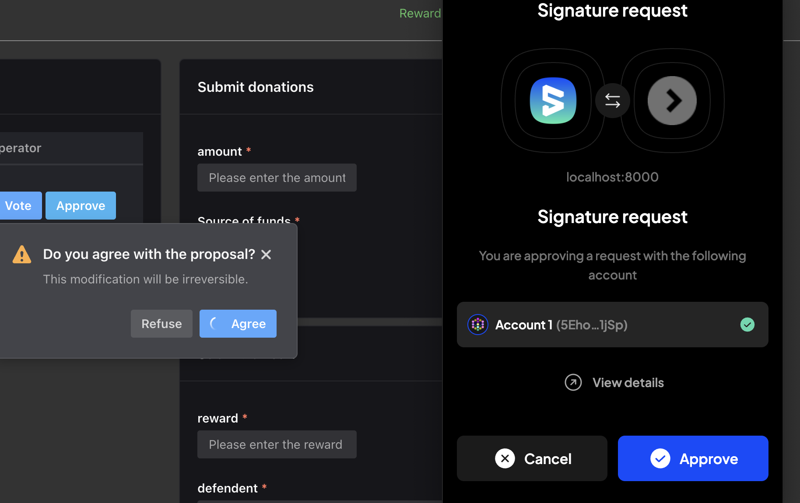
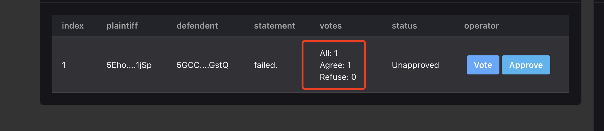
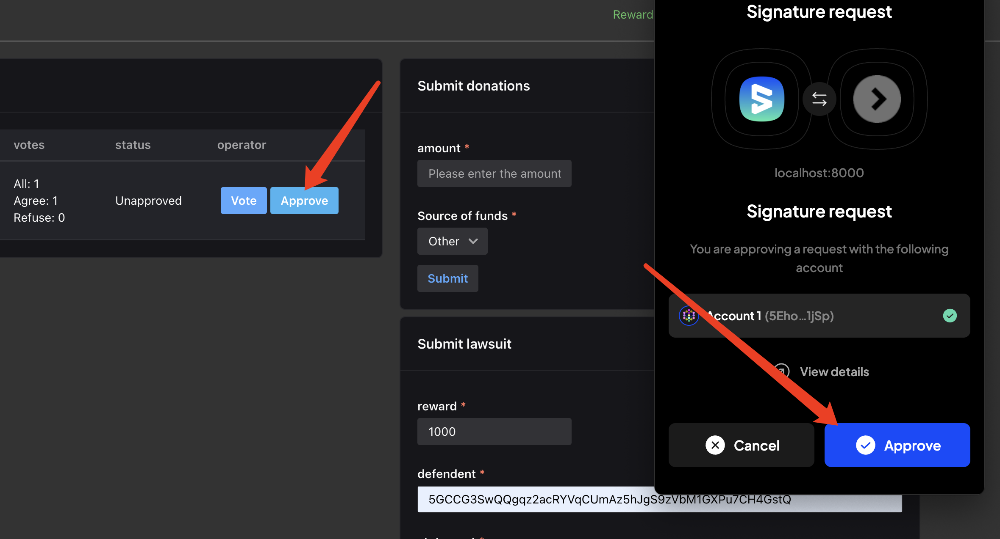

# SaaS3 DAO Frontend Interaction Process

## 1. Making Donations

1. **amount: The donation amount**
2. **source of funds: The source of the donation**

Fill in the information and submit for authorization to complete the donation. The funds will be transferred to the SaaS3 DAO.

Please note that the above process is illustrated in the screenshots.

## 2. Submitting Lawsuit Information

1. **reward: The reward for requesting the lawsuit information**
2. **defendant: The defendant in the lawsuit**
3. **statement: The content of the lawsuit**

Fill out the form and submit it, waiting for the information to be stored on the blockchain. This step requires wallet authorization and incurs a gas fee for interacting with on-chain data.

After the information is stored on the blockchain, you can view the submitted lawsuit information in the table and proceed to vote and approve.

## 3. Voting on Lawsuit

Users can vote on the lawsuit information to determine the final outcome of the lawsuit.

Wait for the transaction to be confirmed on the blockchain. Refresh the data.

## 4. Approving Lawsuit

Approve the lawsuit information.
